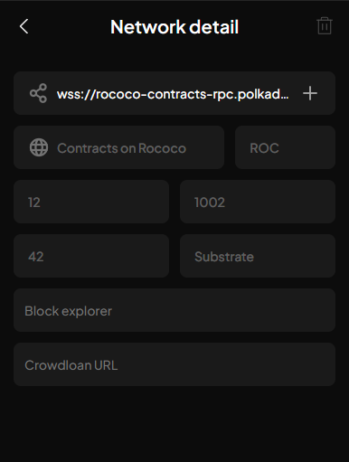
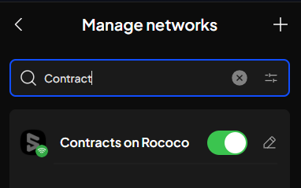
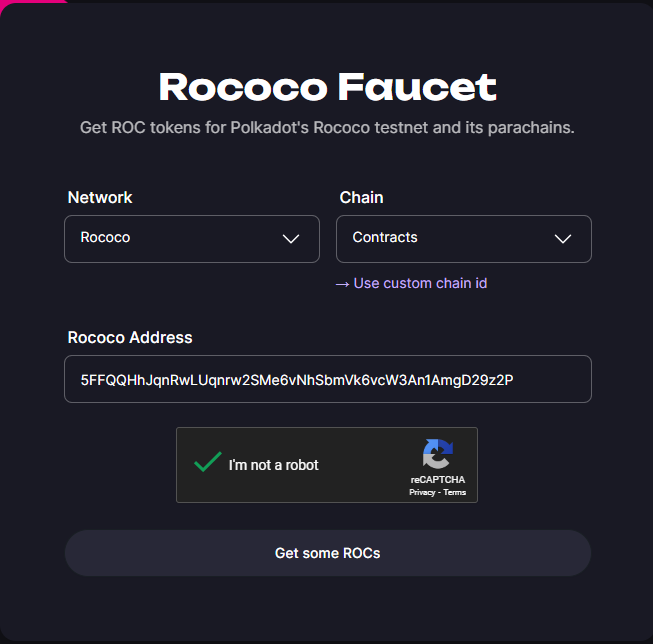
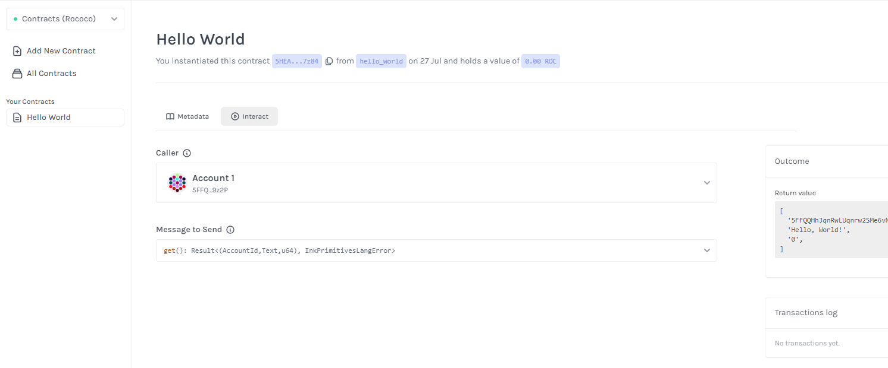
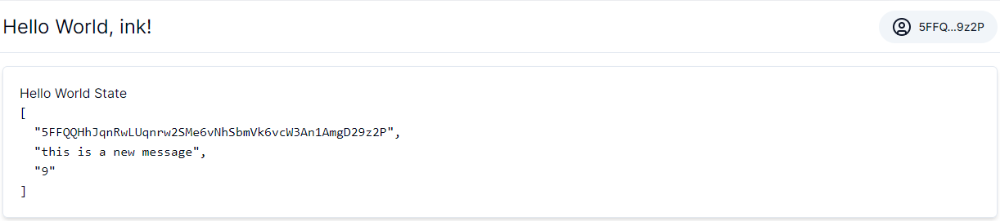

In the [previous post](../25/ink-your-way-to-decentralized-apps-a-polkadot-smart-contract-tutorial.md), we built our first "Hello World" smart contract with `ink!`. Now, we're taking that creation out into the world and deploying it on the Rococo Contract Testnet, marking an exciting step towards bringing our ideas to life.

Get ready to witness your DApp come alive on a real blockchain network! Let's dive into the deployment process and experience the power of `ink!`.

## Prerequisites

Before we start, make sure you have the following prerequisites:

1. A Polkadot.js browser extension installed on your browser. If you haven't installed it yet, you can find it [here](https://polkadot.js.org/extension/) or you can use [Subwallet](https://www.subwallet.app) extension instead. In this tutorial, I will use the Subwallet extension.

2. A GitHub account to clone the `Hello World Contract` repository from [here](https://github.com/HongThaiPham/polkadot-ink-hello-world-contract)

3. A code editor to modify the contract code. I will use Visual Studio Code in this tutorial.

4. Because this tutorial use Next.js to build the front-end, you need to fimiliar with React.js and Next.js. If you are not fimiliar with React.js and Next.js, you can learn it [here](https://reactjs.org/) and [here](https://nextjs.org/).

## Connect to Rococo Testnet

Rococo is a testnet on Polkadot and Kusama. Utilizing the `pallet-contract`, Rococo allows the deployment and interaction with contracts written in `ink!`, providing an ideal testing ground before launching on the main networks.

### Add Rococo Contract Network to Subwallet

First, we need to connect to the Rococo Testnet. Open the Subwallet extension and click on the top left menu, then select `Manage Networks`. Click on `+` button on the top right corner to add a new network.

Fill in the following information:

> **Network Name**: Rococo
>
> **Provider URL**: wss://rococo-contracts-rpc.polkadot.io



Click `Save` to save the network. Now, you can select the Rococo network from the network list.



### Get Testnet Tokens

To deploy the contract, you need some testnet tokens. You can get the testnet tokens from the [Rococo Faucet](https://faucet.polkadot.io/rococo).

At the Rococo Faucet page, select the `Rococo` network and Chain `Contracts`. Fill in your Rococo address and click on the `Get some ROCs` button to get the testnet tokens.



## Deploy the Contract

### Clone and build the contract

Clone the `Hello World Contract` repository from [here](https://github.com/HongThaiPham/polkadot-ink-hello-world-contract) and navigate to the project folder.

```bash
git clone https://github.com/HongThaiPham/polkadot-ink-hello-world-contract.git

cd polkadot-ink-hello-world-contract
```

Build the contract by running the following command:

```bash
cargo contract build
```

### Deploy contract

After building the contract, you will see the contract file in the `target/ink` folder. Now, you can deploy the contract using the `ink! smart contract UI`.

Open your browser and navigate to [ink! smart contract UI](https://ui.use.ink/). At the top left corner, change the network to `Contracts (Rococo)`.

Follow this tutorial to deploy the contract using the `ink! smart contract UI`: [Deploy a Contract](../25/ink-your-way-to-decentralized-apps-a-polkadot-smart-contract-tutorial.md#2-deploy-the-smart-contract-on-the-local-substrate-node).

After deploying the contract, you will get the contract address. Save the contract address for the next step.



## Build the Frontend

Now, we will build the frontend to interact with the deployed contract. While we could leverage pre-built solutions like the [ink!athon Boilerplate](https://github.com/scio-labs/inkathon) to quickly set up a frontend for our DApp, this tutorial takes a "build-from-scratch" approach using Next.js. This allows us to understand the underlying mechanics and gain greater flexibility in customizing our frontend.

This approach provides a deeper understanding of integrating blockchain components into web applications, proving particularly beneficial for learning and development purposes.

> In a real-world scenario, consider using boilerplates or frameworks like ink!athon to streamline the development process.

Next.js, a popular React framework, provides an excellent foundation for building interactive and performant web applications.

Init a new Next.js project by running the following command:

```bash
npx create-next-app@latest ink-hello-world-dapp
```

### Install dependencies

To interact with the contract, we need to install the `@scio-labs/use-inkathon` package. This library provides typesafe React hooks and utility functions that simplify the process of working with Substrate-based networks and ink! smart contracts.

Install the `@scio-labs/use-inkathon` package by running the following command:

```bash
pnpm add @scio-labs/use-inkathon
# or
npm install @scio-labs/use-inkathon
# or
yarn add @scio-labs/use-inkathon
```

Thank to @scio-labs, that is all you need to do to interact with the ink! smart contract.

### Create .env file

Create a `.env` file in the root folder of the project and add the following environment variables:

```
NEXT_PUBLIC_DEFAULT_CHAIN=contracts
NEXT_PUBLIC_CONTRACT_ADDRESS=5HEAZNvi8CDYeqRAaNro6vsQRUNxXzaakW5fP2RmZECA7z84
NEXT_PUBLIC_CONTRACT_ID=hello_world
```

With `NEXT_PUBLIC_DEFAULT_CHAIN` is the default chain, the value `contracts` mean Contract Rococo network. `NEXT_PUBLIC_CONTRACT_ADDRESS` is the contract address what you get from the previous step. `NEXT_PUBLIC_CONTRACT_ID` is the contract name. Replace the value with your contract address and contract name.

### How to connect your Dapp to network

To connect to network, we will create a provider to wrap our application with `UseInkathonProvider` from `@scio-labs/use-inkathon`.

```typescript
"use client";
import React, { PropsWithChildren } from "react";
import {
  contracts,
  SubstrateDeployment,
  UseInkathonProvider,
} from "@scio-labs/use-inkathon";

import metadata from "@/artifacts/hello_world.json";
import { Toaster } from "./ui/sonner";
import { QueryClient, QueryClientProvider } from "@tanstack/react-query";
const queryClient = new QueryClient();

const AppProvider: React.FC<PropsWithChildren> = ({ children }) => {
  async function getContract(): Promise<SubstrateDeployment[]> {
    return [
      {
        contractId: process.env.NEXT_PUBLIC_CONTRACT_ID as string,
        networkId: contracts.network,
        abi: metadata,
        address: process.env.NEXT_PUBLIC_CONTRACT_ADDRESS as string,
      },
    ];
  }
  return (
    <QueryClientProvider client={queryClient}>
      <UseInkathonProvider
        appName="Hello World, ink!"
        connectOnInit={true}
        defaultChain={process.env.NEXT_PUBLIC_DEFAULT_CHAIN as string}
        deployments={getContract()}
      >
        {children}
        <Toaster />
      </UseInkathonProvider>
    </QueryClientProvider>
  );
};

export default AppProvider;
```

In the above code, we create a provider to wrap our application with `UseInkathonProvider` from `@scio-labs/use-inkathon`. We also create a `getContract` function to get the contract information. You can have multiple contracts in the `getContract` function. In this tutorial, we only have one contract.

At this point, we need to copy the `hello_world.json` file from the `target/ink` folder in contract repo folder to the `artifacts` folder in the frontend project. This file contains the contract metadata that is used to interact with the contract.

To connect to wallet, we will create `ConnectWalletButton` component, what use function `connect` from `useInkathon` hook.

```typescript
const {
  isConnected,
  connect,
  accounts,
  isConnecting,
  disconnect,
  activeAccount,
} = useInkathon();
```

Call the `connect` function to connect to the wallet.

```typescript
const handleConnectWallet = () => {
  if (connect) connect();
};
```

Call the `disconnect` function to disconnect from the wallet.

```typescript
const handleDisconnectWallet = () => {
  if (disconnect) disconnect();
};
```

You can use the `isConnected` variable to check if the wallet is connected.

```typescript
if (!isConnected) {
  return <Button onClick={handleConnectWallet}>Connect wallet</Button>;
}
```

The `accounts` variable contains the list of accounts that are connected. The `activeAccount` variable tells you which account is active to interact with the contract.

### Query contract state

To query the contract state, we will use the `contractQuery` from `@scio-labs/use-inkathon`.

```typescript
import {
  contractQuery,
  decodeOutput,
  useInkathon,
  useRegisteredContract,
} from "@scio-labs/use-inkathon";

import {
  contractQuery,
  decodeOutput,
  useInkathon,
  useRegisteredContract,
} from "@scio-labs/use-inkathon";
import { useQuery } from "@tanstack/react-query";
import { toast } from "sonner";

const useHelloWorldState = () => {
  const { api } = useInkathon();
  const contractId = process.env.NEXT_PUBLIC_CONTRACT_ID as string;

  const { contract } = useRegisteredContract(contractId);
  return useQuery({
    queryKey: ["get-hello-world-state"],
    queryFn: async () => {
      if (!contract || !api) return;
      const result = await contractQuery(api, "", contract, "get");
      const { output, isError, decodedOutput } = decodeOutput(
        result,
        contract,
        "get"
      );
      if (isError) {
        toast.error("Error fetching contract state");
        return;
      }
      return output;
    },
    enabled: !!contract && !!api,
  });
};

export default useHelloWorldState;
```

In the above code, we create a custom hook `useHelloWorldState` to query the contract state.

The first step because you have registered the contract when setting up the provider, you can get the contract instance through the `useRegisteredContract` hook by passing the contract id.

```typescript
const { contract } = useRegisteredContract(contractId);
```

Next, we use the `contractQuery`. The `contractQuery` function takes the following parameters:

- `api`: The Substrate API instance.
- `address`: The account to use for the query. For contract query, you can leave it empty.
- `contract`: The contract instance.
- `method`: The contract method to call. In this case, we call the `get` method to get the contract state.

```typescript
const result = await contractQuery(api, "", contract, "get");
```

Now, we have the response from the contract query. We can decode the output using the `decodeOutput` function.

```typescript
const { output, isError, decodedOutput } = decodeOutput(
  result,
  contract,
  "get"
);
```

`decodedOutput` takes the encoded responce from the contract and the contract instance to decode the output.

Finally, we can display the decoded ouput to the user.



### Call contract method to mutate the state

To call the contract method to mutate the state, we will use the `contractTx` from `@scio-labs/use-inkathon`.

```typescript
import {
  contractTx,
  useInkathon,
  useRegisteredContract,
} from "@scio-labs/use-inkathon";
import { useMutation, useQueryClient } from "@tanstack/react-query";
import { toast } from "sonner";

const useSetHelloWorldState = () => {
  const queryClient = useQueryClient();
  const { api, activeAccount } = useInkathon();
  const contractId = process.env.NEXT_PUBLIC_CONTRACT_ID as string;

  const { contract } = useRegisteredContract(contractId);
  return useMutation({
    mutationKey: ["set-hello-world-state"],
    mutationFn: async (message: string) => {
      if (!contract || !api || !activeAccount) return;
      return toast.promise(
        contractTx(api, activeAccount.address, contract, "set", {}, [message]),
        {
          loading: "Setting contract state...",
          success: async () => {
            await queryClient.invalidateQueries({
              queryKey: ["get-hello-world-state"],
            });
            return "Successfully set contract state";
          },
          error: "Error setting contract state",
        }
      );
    },
  });
};

export default useSetHelloWorldState;
```

In the above code, we create a custom hook `useSetHelloWorldState` to mutate the state.

We need to get the contract instance that we want to call by using the `useRegisteredContract` hook and passing the contract id.

Get the active account information through the `activeAccount` variable.

Next, use the `contractTx` function to call the contract method. The `contractTx` function takes the following parameters:

- `api`: The Substrate API instance.
- `address`: The account to use for the transaction. That is the active account.
- `contract`: The contract instance.
- `method`: The contract method to call. In this case, we call the `set` method to set the contract state.
- `options`: The options for the transaction. You can custom `gasLimit` or `storageDepositLimit` here. In this case, we don't need to custom the options.
- `params`: The parameters for the method. They passed as an array follow the order of the method parameters. In this case, we just pass a array with one element is the `message`.

```typescript
contractTx(api, activeAccount.address, contract, "set", {}, [message]),
```

## Conclusion

Congratulations! You have successfully built a Hello World DApp and interacted with it on the Rococo Contract Testnet using `ink!` smart contract. This tutorial has provided a comprehensive guide to deploying a smart contract and building a frontend to interact with it.

You can find the full source code of the project on [GitHub](https://github.com/HongThaiPham/ink-hello-world-dapp)
