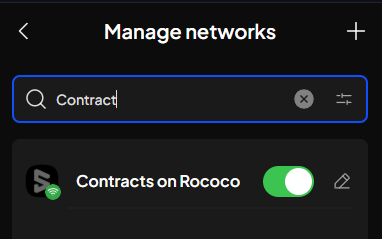

In the [previous post](../25/ink-your-way-to-decentralized-apps-a-polkadot-smart-contract-tutorial.md), we built our first "Hello World" smart contract with `ink!`. Now, we're taking that creation out into the world and deploying it on the Rococo Contract Testnet, marking an exciting step towards bringing our ideas to life.

Get ready to witness your DApp come alive on a real blockchain network! Let's dive into the deployment process and experience the power of `ink!`.

## Prerequisites

Before we start, make sure you have the following prerequisites:

1. A Polkadot.js browser extension installed on your browser. If you haven't installed it yet, you can find it [here](https://polkadot.js.org/extension/) or you can use [Subwallet](https://www.subwallet.app) extension instead. In this tutorial, I will use the Subwallet extension.

2. A GitHub account to clone the `Hello World Contract` repository from [here](https://github.com/HongThaiPham/polkadot-ink-hello-world-contract)

3. A code editor to modify the contract code. I will use Visual Studio Code in this tutorial.

4. Because this tutorial use Next.js to build the front-end, you need to fimiliar with React.js and Next.js. If you are not fimiliar with React.js and Next.js, you can learn it [here](https://reactjs.org/) and [here](https://nextjs.org/).

## Connect to Rococo Testnet

Rococo is a testnet on Polkadot and Kusama. Utilizing the `pallet-contract`, Rococo allows the deployment and interaction with contracts written in `ink!`, providing an ideal testing ground before launching on the main networks.

### Add Rococo Contract Network to Subwallet

First, we need to connect to the Rococo Testnet. Open the Subwallet extension and click on the top left menu, then select `Manage Networks`. Click on `+` button on the top right corner to add a new network.

Fill in the following information:

> **Network Name**: Rococo
>
> **Provider URL**: wss://rococo-contracts-rpc.polkadot.io


Click `Save` to save the network. Now, you can select the Rococo network from the network list.



### Get Testnet Tokens

To deploy the contract, you need some testnet tokens. You can get the testnet tokens from the [Rococo Faucet](https://faucet.polkadot.io/rococo).

At the Rococo Faucet page, select the `Rococo` network and Chain `Contracts`. Fill in your Rococo address and click on the `Get some ROCs` button to get the testnet tokens.


## Deploy the Contract

### Clone and build the contract

Clone the `Hello World Contract` repository from [here](https://github.com/HongThaiPham/polkadot-ink-hello-world-contract) and navigate to the project folder.

```bash
git clone https://github.com/HongThaiPham/polkadot-ink-hello-world-contract.git

cd polkadot-ink-hello-world-contract
```

Build the contract by running the following command:

```bash
cargo contract build
```

### Deploy contract

After building the contract, you will see the contract file in the `target/ink` folder. Now, you can deploy the contract using the `ink! smart contract UI`.

Open your browser and navigate to [ink! smart contract UI](https://ui.use.ink/). At the top left corner, change the network to `Contracts (Rococo)`.

Follow this tutorial to deploy the contract using the `ink! smart contract UI`: [Deploy a Contract](../25/ink-your-way-to-decentralized-apps-a-polkadot-smart-contract-tutorial.md#2-deploy-the-smart-contract-on-the-local-substrate-node).

After deploying the contract, you will get the contract address. Save the contract address for the next step.


## Build the Frontend

Now, we will build the frontend to interact with the deployed contract. We will use Next.js to build the frontend.

Init a new Next.js project by running the following command:

```bash
npx create-next-app@latest ink-hello-world-dapp
```
